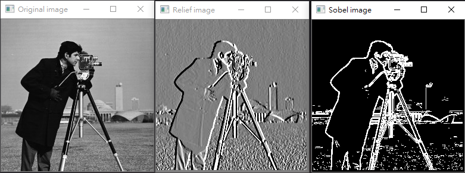
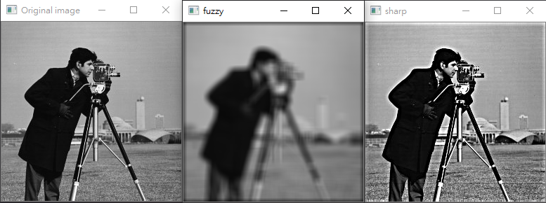
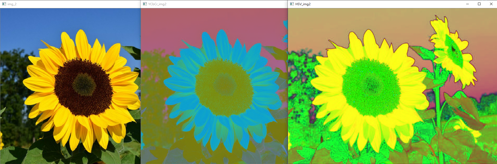
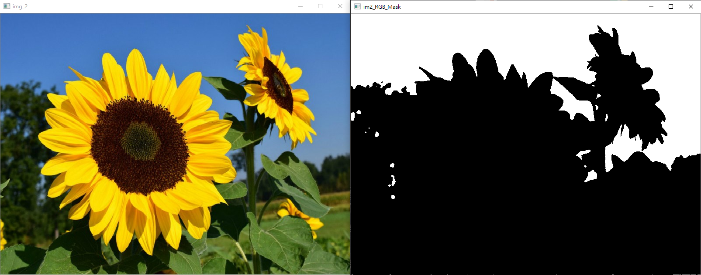
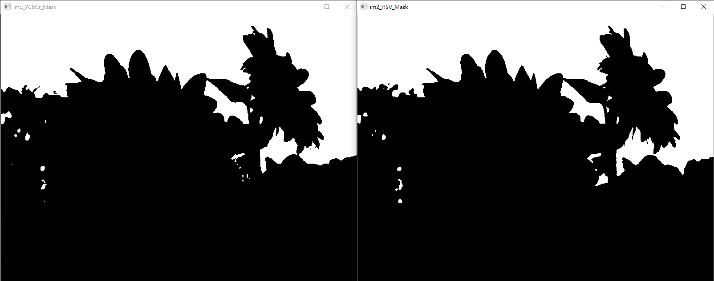
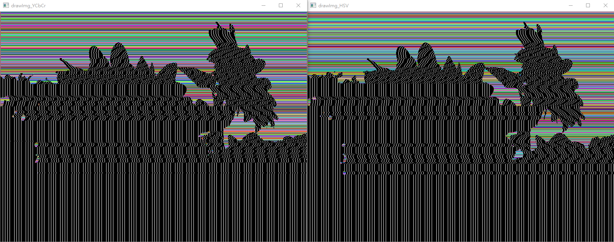
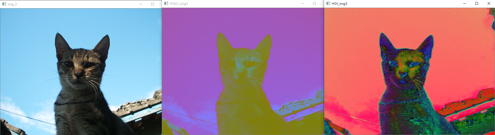
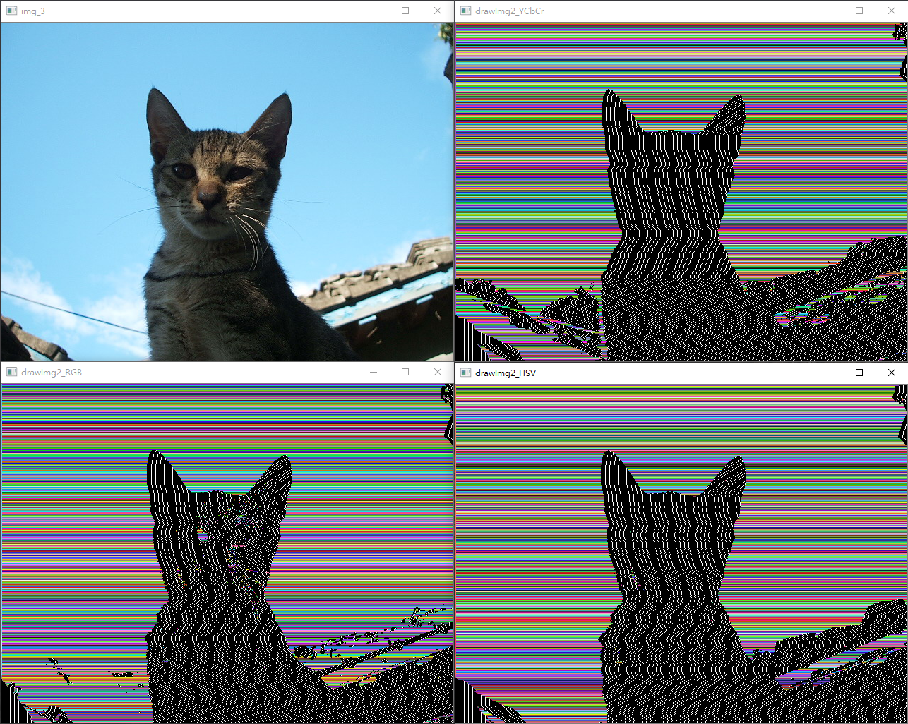

# Edge detection and Unsharp Masking

|Author|Chieh-Ting Chung|
|---|---
|E-mail|sksksk1748@gmail.com

## Memo

* Image Processing , Edge detection and Unsharp Masking , ColorSegmentation 

## Algorithm
* Edge detection
    1. 讀取附件的 8-bit 灰階影像
    2. 顯示輸入影像
    3. 將影像轉換成 double 格式，數值範圍在[0 1]之間
    4. 用雙層迴圈由左而右，由上而下讀取以(x,y)為中心的 3x3 影像區域
    5. 將 3 x 3 影像區域點對點乘上圖 1 Sobel 濾鏡數值矩陣後，將數值總和存入輸出影像的(x,y) 位置
    6. 將濾波後的影像加上 0.5，呈現近似浮雕影像
    7. 分別將濾波後的影像開絕對值，再二值化(門檻值自訂)，用 bitor (bitwise or)或直接相加，產生近似輪廓影像
    8. 轉成 8bit，儲存影像檔

* Unsharp Masking
    * [詳細卷積原理請看【HackMD】影像處理實作筆記](https://hackmd.io/@4_NJd1RURCuQpLve1gMcVw/ryhPYubtP)
    1. 輸入影像模糊參數(例如均值濾波的濾鏡尺寸 n)
    2. 讀取附件的 8-bit 灰階影像
    3. 顯示輸入影像
    4. 將影像轉換成 double 格式，數值範圍在[0 1]之間
    5. 用雙層迴圈對 n*n 濾鏡(均值濾鏡或高斯濾鏡)做影像模糊化
    6. 利用原圖與模糊影像的差異，加上原圖，獲得銳利影像

* Color Segmentation 
    1. 根據附件影像(sky.jpg)與其藍天區域遮罩(sky_mask.jpg)，分別統計藍天在RGB/YCbCr/HSV 三種色空間中的平均值與標準差。
    2. 自己找兩幅有藍天的照片，運用 RGB, YCbCr, HSV 三種色空間與步驟(1)獲得的藍天範圍(平均值+擴大的標準差範圍)，分別分割照片中的藍天區域。製作分割天空的二值化影像(藍天區域為白色，其餘為黑色)
        - 使用 sky_2.jpg 跟 sky_8.jpg
    3. 根據步驟(2)的方法，將兩幅照片處理成藍天為彩色，其餘區域為黑白的影像。
    4. 分割的效果很可能不佳，請比較哪一種色空間的分割效果較好

## Your `~/ImageHW1/` folder should look like this
```
ImageHW1
├── image/
│   └── ...
└── ...

```

## Result

* Edge detection
    * 

* Unsharp Masking
    * 

* Color Segmentation 
    * sky.jpg 跟 sky_mask.jpg AND 後的結果
        * 
        * 
        *  
    * 色彩空間圖(RGB / YCbCr / HSV)
        * 
    * sky_2.jpg 將 sky.jpg 和 sky_mask.jpg AND 後的圖，用圖裡藍天的平均值與標準差分割向日葵圖
        * 
        * 
    * 填入彩色與黑白
        * 
        * 
    * 色彩空間圖(RGB / YCbCr / HSV)
        * 
    * sky_8.jpg 將 sky.jpg 和 sky_mask.jpg AND 後的圖，用圖裡藍天的平均值與標準差分割貓咪圖
        * 
    * 填入彩色與黑白
        * 
## Reference

* NTUST , Pei-Li Sun PROFESSOR